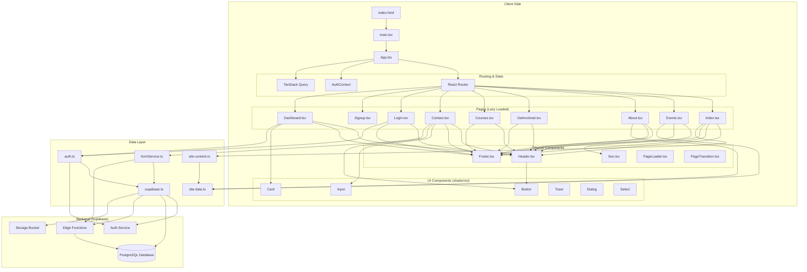
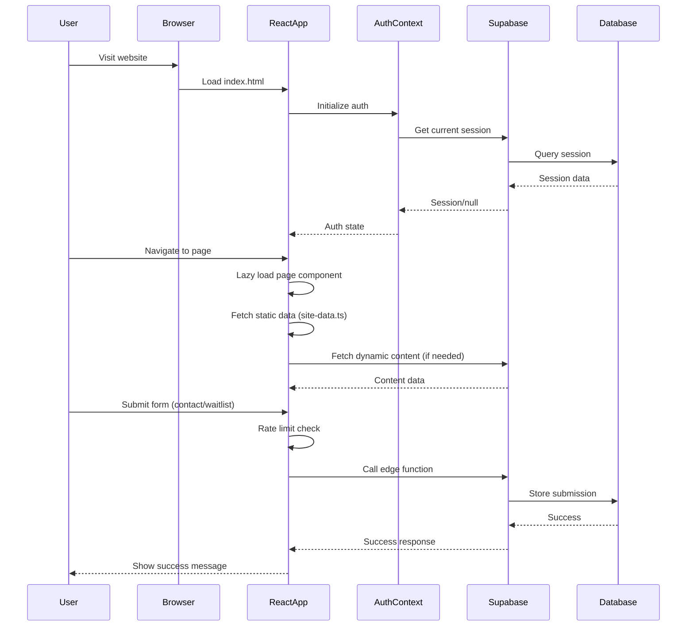

# STEMise Website Architecture Diagram

## System Overview

The STEMise website is a modern React-based single-page application built with TypeScript, Vite, and Supabase for backend services.



## Data Flow Diagram



## Key Architecture Patterns

### 1. **Lazy Loading & Code Splitting**
- All pages are lazy-loaded using React's `lazy()` and `Suspense`
- Improves initial load performance by splitting code by route

### 2. **Authentication Flow**
- Supabase Auth handles user sessions
- `AuthContext` provides global auth state
- `ProtectedRoute` component guards private routes
- Session persistence via Supabase client configuration

### 3. **Data Management**
- **Static Content**: Stored in `site-data.ts` (events, team, impact metrics)
- **Dynamic Content**: Fetched via TanStack Query hooks from `site-content.ts`
- **Form Submissions**: Handled by `formService.ts` with rate limiting
- **Fallback Pattern**: Static data serves as fallback if Supabase is unavailable

### 4. **Component Architecture**
- **Layout Components**: Header, Footer (shared across pages)
- **Feature Components**: Page-specific sections (HeroShapes, HomeImpactSection)
- **UI Components**: Reusable shadcn/ui components (Button, Card, Dialog)
- **Utility Components**: PageLoader, PageTransition, ScrollEffects

### 5. **Routing Structure**
```
/                    → Index (Home)
/events              → Events listing
/about               → About page
/get-involved        → Get involved/donate
/curriculum          → Curriculum overview
/curriculum/age/:id  → Age-specific curriculum
/contact             → Contact form
/login               → Login page
/signup              → Signup page
/dashboard           → Protected dashboard
```

### 6. **Backend Integration**
- **Supabase Auth**: User authentication and session management
- **PostgreSQL**: Data persistence (forms, content)
- **Edge Functions**: Protected form submissions with rate limiting
- **Storage**: Static assets (images, documents)
- **Real-time**: Auth state changes via Supabase subscriptions

## Technology Stack

### Frontend
- **Framework**: React 18.3 with TypeScript
- **Build Tool**: Vite 7.3
- **Routing**: React Router DOM 6.30
- **State Management**: React Context + TanStack Query 5.83
- **UI Library**: shadcn/ui (Radix UI primitives)
- **Styling**: TailwindCSS 3.4
- **Animations**: Framer Motion 12.29
- **Icons**: Lucide React 0.462

### Backend
- **BaaS**: Supabase (PostgreSQL, Auth, Storage, Edge Functions)
- **Database**: PostgreSQL with migrations
- **Authentication**: Supabase Auth (email/password)
- **Rate Limiting**: Client-side + Edge function validation

### Development
- **Package Manager**: npm 10.9.3
- **Node**: >=20.19.0
- **Linting**: ESLint 9.32 with TypeScript support
- **Deployment**: Netlify (via netlify.toml)

## Key Files & Their Responsibilities

### Core Application Files
- `index.html` - HTML entry point with meta tags and SEO
- `src/main.tsx` - React application bootstrap
- `src/App.tsx` - Root component with routing and providers

### Configuration Files
- `vite.config.ts` - Vite build configuration
- `tailwind.config.ts` - TailwindCSS customization
- `tsconfig.json` - TypeScript compiler options
- `components.json` - shadcn/ui configuration

### Data & Business Logic
- `src/lib/site-data.ts` - Static content (events, team, impact data)
- `src/lib/site-content.ts` - Content fetching with TanStack Query
- `src/lib/supabase.ts` - Supabase client initialization
- `src/lib/auth.ts` - Authentication functions
- `src/lib/formService.ts` - Form submission with rate limiting

### Context & State
- `src/contexts/AuthContext.tsx` - Global authentication state

### Pages (Route Components)
- `src/pages/Index.tsx` - Homepage
- `src/pages/Events.tsx` - Events listing
- `src/pages/About.tsx` - About/team page
- `src/pages/Contact.tsx` - Contact form
- `src/pages/Login.tsx` - Authentication
- `src/pages/Dashboard.tsx` - Protected user dashboard

### Shared Components
- `src/components/Header.tsx` - Navigation header
- `src/components/Footer.tsx` - Site footer
- `src/components/ProtectedRoute.tsx` - Route protection wrapper
- `src/components/Seo.tsx` - SEO meta tags management

### Database Schema
- `supabase/migrations/` - PostgreSQL schema migrations
- `supabase/functions/` - Edge functions for form processing

## Security Features

1. **Environment Variables**: Sensitive data stored in `.env` (Supabase URL/keys)
2. **Rate Limiting**: Client-side localStorage + Edge function validation
3. **Protected Routes**: `ProtectedRoute` component checks auth state
4. **CAPTCHA Integration**: Turnstile widget for form submissions
5. **Supabase RLS**: Database row-level security policies
6. **Edge Function Validation**: Server-side form validation before database writes

## Performance Optimizations

1. **Code Splitting**: Lazy-loaded routes reduce initial bundle size
2. **Static Data Caching**: TanStack Query with infinite stale time
3. **Image Optimization**: Responsive images with proper sizing
4. **Tree Shaking**: Vite automatically removes unused code
5. **CSS Purging**: TailwindCSS removes unused styles in production
